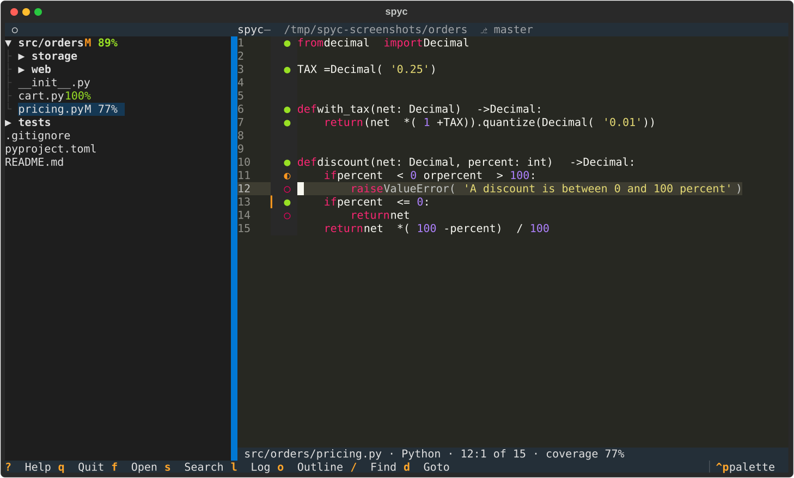
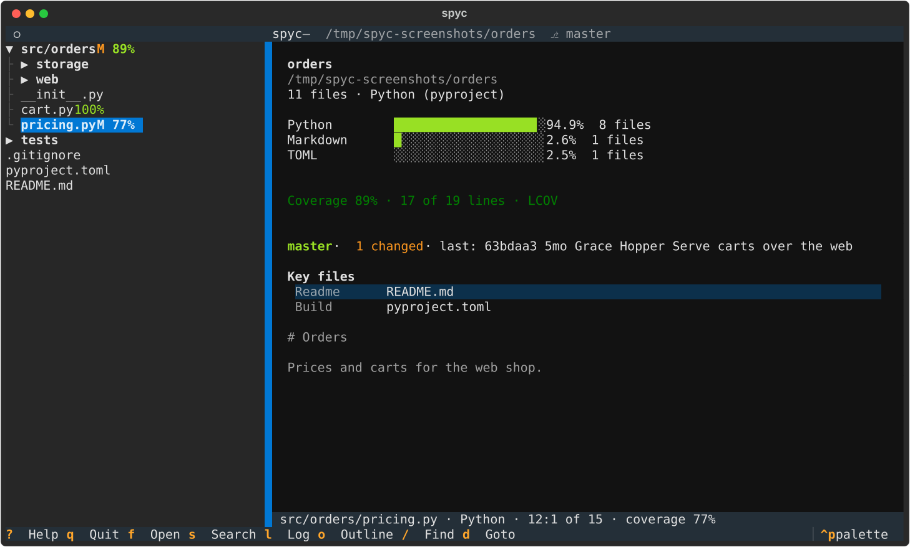
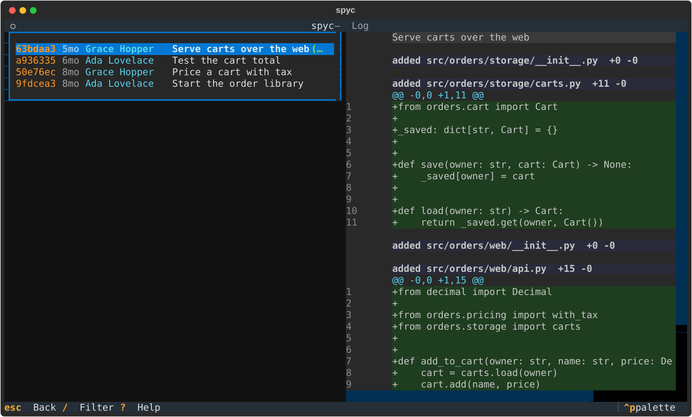

# spyc

[](https://github.com/adeptum-labs/spyc/actions/workflows/tests.yml)
[](https://github.com/adeptum-labs/spyc/actions/workflows/release.yml)
[](https://github.com/adeptum-labs/spyc/releases)

spyc is short for "spy code": a terminal viewer for browsing code bases. It finds the project you point it at, shows an
overview of it, lists the files as a tree, colors the code, shows the history from git, and is meant to be the tool you
open a code base with.







## Requirements

- Python 3.11 or later, when installing from source
- `git` on the path (lists the files of a project and gives the history, changes and blame)
- `rg` (ripgrep) is optional: it makes the search of the whole project fast and is needed for pattern search; without
  it the files are read in Python and the search is literal
- `claude` (Claude Code) is optional: when it is on the path and logged in, `a` describes a directory, package, file or
  class

## Install

Each release has a Debian package and a single-file executable for `amd64` and `arm64`. They are built on Debian 12
and run on Debian 12 and later and on Ubuntu 24.04 and later (they need glibc 2.36), and need no Python.

```sh
sudo apt install ./spyc_0.1.0-1_amd64.deb     # brings git, and ripgrep as a recommendation
chmod +x spyc-linux-amd64 && ./spyc-linux-amd64   # or the executable, which needs only git
```

The executable unpacks itself into a temporary directory on each start, so it starts a little slower than the
installed package. From source, `pip install .` gives the `spyc` command.

## Usage

```sh
spyc                       # the current directory
spyc path/to/dir           # a directory
spyc path/to/file.py:42    # a file, opened at line 42
spyc --coverage lcov.info  # show what a coverage report says; may be given more than once
```

`spyc` opens at the root of the project that contains the path: the git top level, or else the nearest directory with
a build file such as `pom.xml`, `Cargo.toml`, `go.mod` or `pyproject.toml`. The overview shows the languages by size,
the build systems and the key files, such as the README, the build files, the CI configuration and the entry points.

## Keys

| Keys | What they do |
|---|---|
| `f` | Find a file by name; `name:line` jumps to a line |
| `s` | Search the text of the project (ripgrep when installed); `alt+r` or `F2` for a pattern, `alt+w` or `F3` for whole words |
| `o` | Outline: the definitions of the open file |
| `t` | Find a definition anywhere in the project |
| `d` | Go to the definition of the name under the cursor, the nearest first; `[` comes back |
| `/` | Find in the file; `n` and `N` step through the matches |
| `:` | Go to a line |
| `[` `]` | Back and forward through the files you have visited |
| `l` | Commit log; the diff of each commit beside it, `/` filters by message, `Enter` on a diff line opens it |
| `L` | History of the open file, following renames |
| `B` | Branches, compared with the default branch: `Enter` the log, `d` the diff, `v` browse the files read-only without switching branch; the first row returns to the working tree |
| `g` | All uncommitted changes, staged or not, and new files, as one diff |
| `b` | Show who last changed each line; `Enter` on a line opens that commit |
| `c` | Show or hide what the tests ran, from the coverage reports |
| `G` | Dependency graph: the packages of one level as layered boxes, what depends on what above what it depends on, with a count on each line; arrow keys or `Tab` select, `Enter` goes into a box, `Backspace` out of it, `/` finds, `c` finds cycles, `o` opens the code |
| `a` | Ask Claude to describe the directory, package, file or class; only when `claude` is installed and logged in |
| `e` | Edit in `$VISUAL` or `$EDITOR` at the cursor line |
| `p` | Copy `path:line` to the clipboard |
| `i` | Project overview |
| `\` | Show or hide the file tree |
| `>` `<` | Widen or narrow the file tree; dragging the line beside it with the mouse resizes it too, and the width is remembered |
| `.` | Show or hide files that git ignores |
| `R` | Read the file list again |
| `r` | Rendered or source view of a Markdown file |
| `Tab` | Switch between the tree and the code |
| `?` | The key reference |
| `q` | Quit |
| `↑` `↓` `j` `k`, `←` `→` | Move by line and by character |
| `Home` `End` | Start or end of the line |
| `PgUp` `PgDn` `Space`, `ctrl+u` `ctrl+d` | Move by page or half a page |
| `ctrl+Home` `ctrl+End` | Start or end of the file |
| `Enter` | Open the file in the tree; `←` and `→` close and open directories |
| `ctrl+p` | Command palette, where the color theme can be changed |

Outline and go-to-definition know the definitions of Python, Java, Kotlin, Go, Rust, JavaScript, TypeScript, C, C++,
Bash and Markdown headings.

In a git repository the tree marks changed files and their directories, the code view marks added, changed and
deleted lines in the margin, and the overview and the title tell the branch, the number of changes and the last
commit. In a branch view the tree, the code, the search, the outline and the graph read from the branch, and
editing, coverage and the changes of the working tree are off. The mouse works too: click to place the cursor,
scroll to move.

## Dependencies

`G` draws the dependencies of the project as boxes in layers: what depends on something is above it, and a dashed line
with a number, the files behind it, runs from each box to the ones it depends on. `Enter` goes into a box and shows its
parts. Test files are left out until `t` shows them. Java, Kotlin, Python, JavaScript, TypeScript, TSX, Go, Rust, C and C++ are read. How each language is read and
what the graph cannot see is described in the [wiki](https://github.com/adeptum-labs/spyc/wiki/Dependencies).

## Asking Claude

`a` has Claude describe what is selected: a directory, a file, a class or a box in the dependency graph. The key exists
only when `claude` is on the path and logged in. Claude gets read-only tools (`Read`, `Grep`, `Glob`) and answers are
cached per project. More in the [wiki](https://github.com/adeptum-labs/spyc/wiki/Asking-Claude).

## Coverage

spyc reads LCOV, Cobertura, JaCoCo XML and Go cover profiles. Reports are recognised by their content and looked for by
their usual names (`lcov.info`, `coverage.xml`, `jacoco.xml`, `jacocoTestReport.xml`, `cover.out` and so on) up to six
directories down, build output included; `--coverage FILE` names them instead. Several reports of a project are merged,
and a line counts as often as its most thorough report says. Reports are read whole, so one over 32 MB is skipped.

In the margin a filled circle (green) is a line that ran, a half one (yellow) a line where some branch was never taken,
and an empty one (red) a line that never ran. The status bar gives the share of the lines of the open file that ran,
and says `(stale)` when the file is newer than its report. The tree shows the share after each file and directory,
and the overview the total. `c` hides and shows the margin and the tree shares, and the choice is remembered. The
paths of a report may be relative, absolute in another checkout, Java package paths or Go import paths; they are
matched to the files of the project by their ends. Reports are read again with `R`.

## Colors

The code is colored with tree-sitter grammars for Bash, C, C++, CSS, Go, HTML, Java, JavaScript, JSON, Kotlin,
Python, Rust, SCSS, SQL, TOML, TSX, TypeScript, XML and YAML. Other languages are colored with Pygments. The theme
follows the one chosen in the command palette and is remembered.

## Files

`state.json` (recent files, theme, sidebar) and `spyc.log` (warnings) are kept in `$XDG_STATE_HOME/spyc`, by default
`~/.local/state/spyc`. What is read from the code of a project (definitions and imports) is cached per project in
`$XDG_CACHE_HOME/spyc`, by default `~/.cache/spyc`, and can be deleted at any time.

## License

Copyright © 2026 Adam Waldenberg, Adeptum AB. Licensed under the GNU General Public License, version 3 or later.
See [LICENSE](LICENSE).
